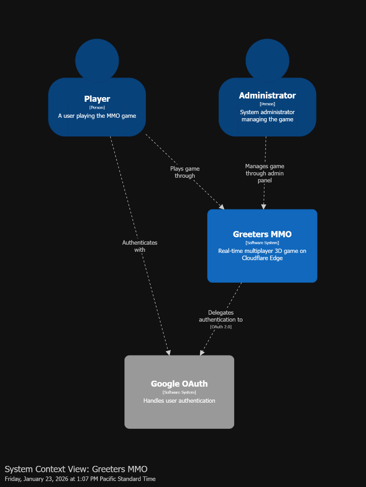
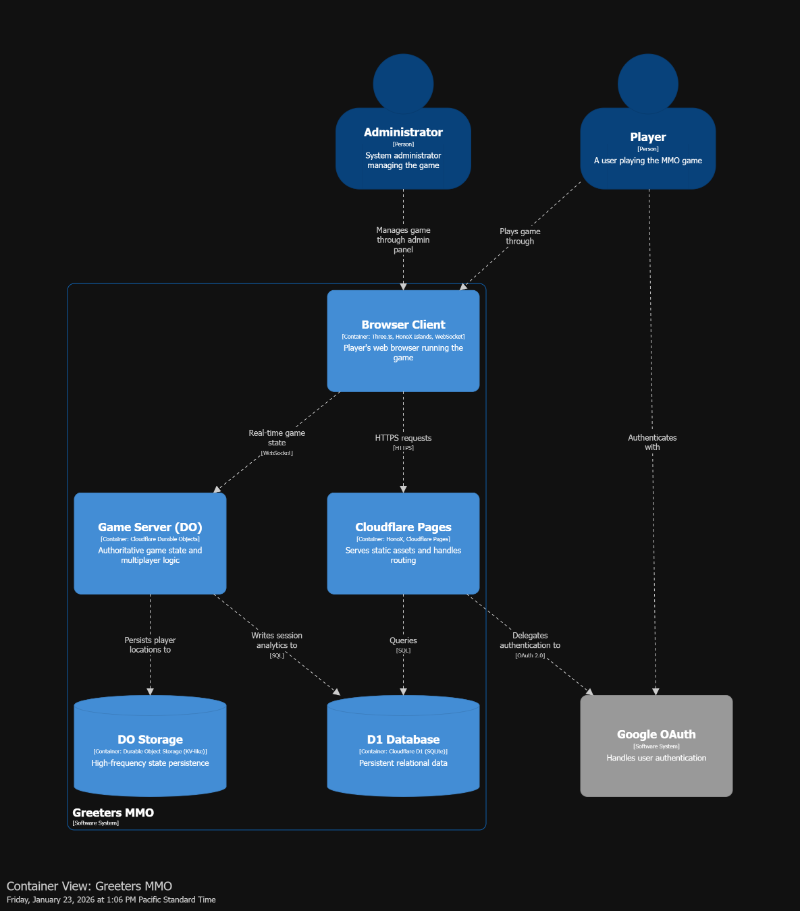
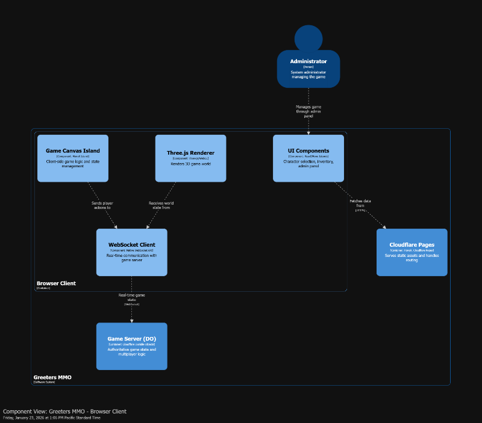
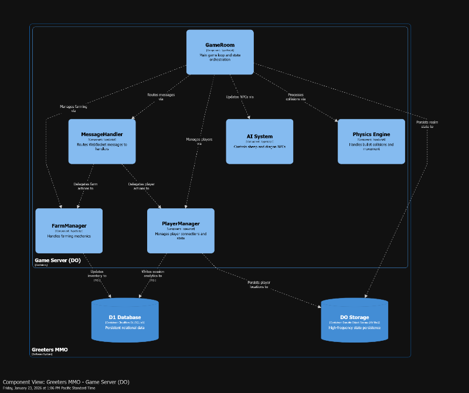
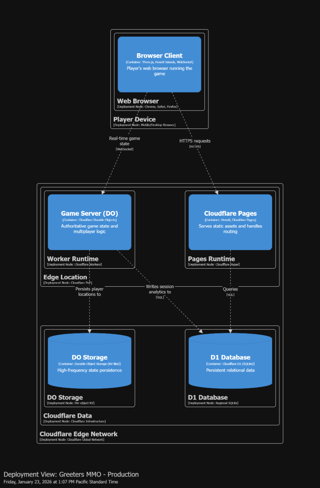

# System Architecture

This document provides a comprehensive overview of the Greeters MMO architecture using the C4 model approach. The diagrams visualize the system at different levels of abstraction, from high-level context down to detailed component interactions.

---

## 📐 Architecture Overview

Greeters is built on **Cloudflare's edge infrastructure**, leveraging Durable Objects for authoritative, low-latency game servers. The architecture follows a client-server model with WebSocket-based real-time communication and includes persistent storage via D1 (SQLite).

**Key Architectural Principles:**
- **Authoritative Server**: All game logic executes server-side to prevent cheating
- **Edge Computing**: Sub-50ms latency via Cloudflare's global network
- **Hot/Cold State**: In-memory for real-time, D1 for persistence
- **Manager Pattern**: Modular game systems for maintainability

---

## 🌐 System Context Diagram

Shows the Greeters MMO system within its environment, including external actors (players, administrators) and external systems (Google OAuth).

**Key Relationships:**
- **Players** interact with the game through their browser
- **Administrators** manage the system via the admin panel
- **Google OAuth** handles authentication for both user types

---

## 📦 Container Diagram

Breaks down the system into major containers (applications and data stores) and shows how they interact.

**Containers:**
1. **Browser Client** - Three.js-based 3D game renderer and UI (TypeScript/WebGL)
2. **Cloudflare Pages** - Static asset hosting and file-based routing (HonoX)
3. **Game Server (Durable Object)** - Authoritative multiplayer game logic (TypeScript)
4. **D1 Database** - Persistent relational data (SQLite)
5. **DO Storage** - High-frequency state persistence (KV-like storage)

**Communication Patterns:**
- Browser ↔ Pages: HTTPS (REST API, authentication)
- Browser ↔ Game Server: WebSocket (real-time game state)
- Game Server ↔ D1: SQL queries (session analytics, inventory updates)
- Game Server ↔ DO Storage: High-frequency reads/writes (player locations, realm state)

---

## 🧩 Component Diagrams

### Browser Client Components

Detailed view of the client-side architecture running in the player's web browser.

**Components:**
- **Three.js Renderer**: WebGL-based 3D world rendering
- **Game Canvas Island**: Client-side game logic and state management (HonoX Island)
- **UI Components**: Character selection, inventory, admin panel (React/Hono Islands)
- **WebSocket Client**: Real-time bidirectional communication with game server

### Game Server Components

Detailed view of the authoritative game server logic running in a Durable Object.

**Components:**
- **GameRoom**: Main game loop orchestrator (10Hz tick rate)
- **MessageHandler**: Routes incoming WebSocket messages to appropriate managers
- **PlayerManager**: Handles player connections, movement, combat
- **FarmManager**: Manages planting, watering, harvesting mechanics
- **AI System**: Controls sheep and dragon NPC behavior
- **Physics Engine**: Processes bullet collisions and movement validation

**Data Flow:**
1. Client sends action via WebSocket
2. MessageHandler routes to appropriate manager
3. Manager updates in-memory state
4. GameRoom broadcasts updated state to all clients
5. Critical updates persisted to DO Storage or D1

---

## 🚀 Deployment Diagram

Shows how the system is deployed to Cloudflare's infrastructure in production.

**Infrastructure:**
- **Cloudflare Edge Network**: Global PoPs for low-latency access
- **Pages Runtime**: Serves static assets and handles routing
- **Worker Runtime**: Executes Durable Object game server code
- **D1 Database**: Regional SQLite instance
- **DO Storage**: Per-object persistent KV storage

**User Flow:**
1. User opens browser on their device (mobile/desktop)
2. Browser loads static assets from nearest Cloudflare PoP
3. WebSocket connection established to Durable Object at edge
4. Game state synchronized in real-time with sub-50ms latency

---

## 🔄 Data Lifecycle

Understanding how data flows through the system:

### Real-Time Game State (Hot Path)
1. **Input**: Player action in browser (move, shoot, plant)
2. **Transport**: WebSocket message to Durable Object
3. **Processing**: MessageHandler routes to manager, state updated in memory
4. **Broadcast**: Updated world state sent to all connected clients
5. **Rendering**: Client updates Three.js scene

**Frequency**: 10Hz (100ms server tick)  
**Storage**: Durable Object memory (RAM)

### Persistent State (Cold Path)
1. **Session End**: Player disconnects
2. **Analytics**: Session stats calculated (kills, deaths, duration)
3. **Persistence**: Data written to D1 database
4. **Location**: Last position saved to DO Storage for respawn

**Frequency**: On disconnect, inventory changes, or critical events  
**Storage**: D1 (long-term) and DO Storage (fast access)

---

## 🛡️ Security Architecture

- **Authentication**: Google OAuth 2.0 flow
- **Authorization**: Server-side validation of all game actions
- **Data Protection**: Sensitive credentials via Cloudflare secrets
- **Network Security**: TLS/SSL for all HTTPS/WSS connections
- **Isolation**: Durable Objects provide per-realm execution isolation

---

## 📈 Performance Characteristics

| Metric | Target | Implementation |
|--------|--------|----------------|
| WebSocket Latency | <50ms | Cloudflare Edge Network |
| Server Tick Rate | 10Hz | GameRoom loop (100ms intervals) |
| Client Frame Rate | 60 FPS | Three.js WebGL renderer |
| Concurrent Players/Realm | 10-20 | Durable Object capacity |
| Database Query Time | <100ms | D1 indexing + edge proximity |

---

## 🔮 Scaling Considerations

**Current Architecture:**
- Each **realm instance** = One Durable Object
- Durable Objects auto-scale by creating new instances
- D1 provides regional read replicas

**Future Enhancements:**
- **Cross-realm messaging**: Use Durable Object stubs for inter-realm chat
- **Database sharding**: Split D1 by region for global scale
- **CDN optimization**: Cache 3D models and textures at edge
- **WebRTC**: Peer-to-peer voice chat for realms

---

## 📚 Additional Resources

- [Full Technical Documentation](./SYSTEM_ARCHITECTURE.md)
- [Deployment Guide](./DEPLOY.md)
- [Structurizr Workspace](./structurizr/workspace.dsl)

---

**Generated with**: [Structurizr Lite](https://structurizr.com/)  
**Model Format**: C4 Architecture Model (DSL)
