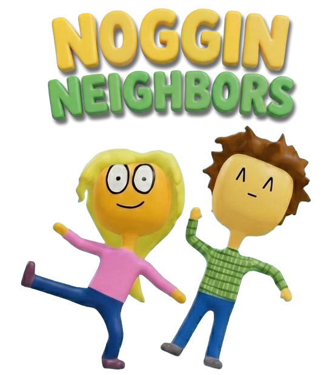
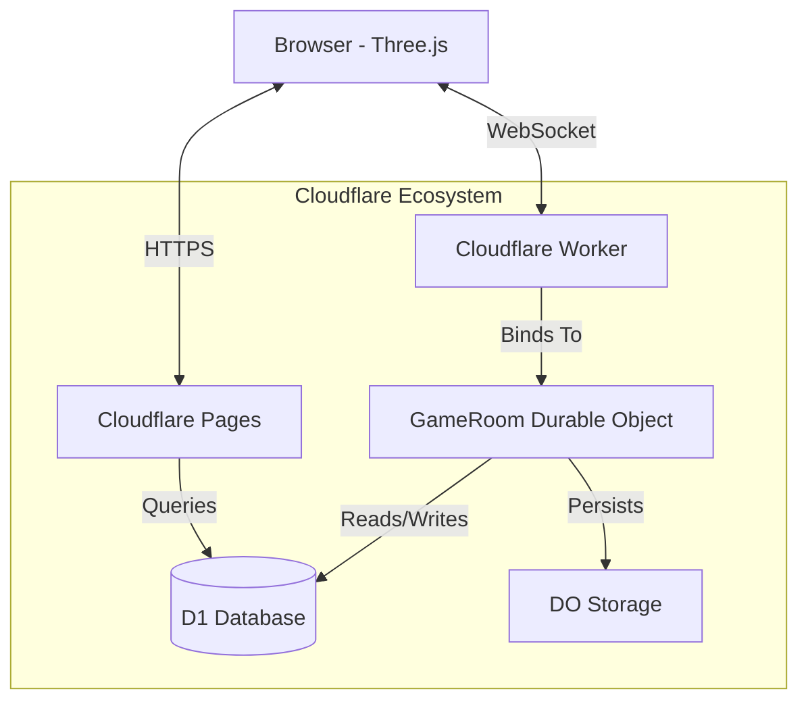

<h1>
  
</h1>


A real-time mobile multiplayer 3D MMO DEMO running entirely on Cloudflare's edge network. Battle dragons, farm resources, and explore with friends—all powered by Durable Objects for ultra-low latency gameplay.

**[🎮 Play Live Mobile Demo](https://antigravity-project-1.pages.dev/)** | [📖 Architecture Docs](./SYSTEM_ARCHITECTURE.md)

---

## 🎯 Overview

Antigravity is a full-stack browser-based MMO that demonstrates advanced cloud-native game development. The entire game server runs on **Cloudflare Durable Objects**, providing authoritative multiplayer gameplay with sub-50ms latency. Players can explore a persistent 3D world, battle AI enemies, harvest crops, customize characters, and create private realm instances with friends.

> [!IMPORTANT]
> **AI-Augmented Development Demo**
> 
> This project is a **demonstration of AI-augmented software development**. The entire codebase was written by AI through iterative prompting and refinement. This project showcases:
> - The capability of modern AI coding assistants to build complex, production-ready applications
> - Effective human-AI collaboration in software engineering
> - AI's ability to work with cutting-edge technologies (Cloudflare Durable Objects, Three.js, WebSocket)
> - Rapid prototyping and iteration using AI-generated code
>
> **As a portfolio piece, this demonstrates my ability to:**
> - Architect complex systems and effectively communicate requirements to AI tools
> - Debug and refine AI-generated code
> - Integrate multiple advanced technologies into a cohesive application
> - Deploy and maintain cloud-native applications

## ✨ Features

- **Real-time Multiplayer Combat** - Authoritative server-side game logic prevents cheating
- **Persistent World** - Player progression, inventory, and stats saved to D1 database
- **Farming & Harvesting** - Plant, water, and harvest crops for resources
- **Character Customization** - Multiple face options and gender selection
- **Private Realm Instances** - Create temporary game sessions with friends
- **AI Enemies** - Battle sheep and dragons with server-controlled AI
- **Admin Panel** - User management, analytics, and game configuration

## 🛠️ Tech Stack

### Frontend
- **HonoX** - Full-stack framework with Islands architecture
- **Three.js** - WebGL-based 3D rendering engine
- **TypeScript** - Strict type safety throughout
- **Vanilla CSS** - Custom styling with modern aesthetics

### Backend
- **Cloudflare Workers** - Edge computing runtime
- **Durable Objects** - Authoritative game server with in-memory state
- **Cloudflare D1** - SQLite-based persistent storage
- **Cloudflare Workers AI** - AI-powered chat responses
- **WebSocket** - Real-time bidirectional communication

## 🏗️ Architecture Highlights

This project showcases several advanced patterns:

1. **Authoritative Server Architecture** - All game logic runs server-side in Durable Objects to prevent client-side cheating
2. **Hot/Cold State Management** - High-frequency data (player positions) in DO memory, persistent data (inventory, stats) in D1
3. **Message Handler Pattern** - Clean separation of WebSocket event handling
4. **Manager Pattern** - Modular game systems (`PlayerManager`, `SheepManager`, `FarmManager`, `DragonManager`)
5. **Realm Instances** - Dynamic creation of isolated game sessions using Durable Object IDs

See [SYSTEM_ARCHITECTURE.md](./SYSTEM_ARCHITECTURE.md) for a deep dive into the technical design.



## 🚀 Local Development

### Prerequisites
- Node.js 16+
- npm or yarn
- Cloudflare account (for deployment)

### Setup

1. **Clone the repository**
   ```bash
   git clone https://github.com/yourusername/antigravity-project-1.git
   cd antigravity-project-1
   ```

2. **Install dependencies**
   ```bash
   npm install
   ```

3. **Configure environment variables**
   ```bash
   cp .dev.vars.example .dev.vars
   ```
   
   Edit `.dev.vars` and add your credentials:
   - `GOOGLE_CLIENT_ID` - Google OAuth client ID
   - `GOOGLE_CLIENT_SECRET` - Google OAuth client secret
   - `GOOGLE_AI_API_KEY` - Google AI API key (for chat)
   - `DO_SECRET` - Secret for Durable Object authentication

4. **Set up the database**
   ```bash
   # Create D1 database (if deploying)
   npx wrangler d1 create antigravity-db
   
   # Update wrangler.toml with your database_id
   # Run migrations
   npx wrangler d1 execute antigravity-db --file=schema.sql
   ```

5. **Run the development server**
   ```bash
   npm run dev
   ```

6. **Open your browser**
   ```
   http://localhost:5173
   ```

## 📦 Deployment

This project uses a two-step deployment process:

1. **Deploy Durable Objects Worker**
   ```bash
   npx wrangler deploy -c wrangler-do.toml
   ```

2. **Deploy Pages Application**
   ```bash
   npm run deploy
   ```

Or use the automated deployment script:
```bash
.\deploy-all.ps1
```

See [DEPLOY.md](./DEPLOY.md) for detailed deployment instructions.

## 🎮 Game Controls

- **WASD** - Move character
- **Mouse Click** - Shoot (if weapon equipped)
- **E** - Interact (plant/water/harvest crops, fish)
- **UI Buttons** - Access inventory, character customization, high scores

## 📁 Project Structure

```
/app
├── durable_objects/      # Game server logic (Durable Objects)
│   ├── GameRoom.ts       # Main game loop and state management
│   ├── PlayerManager.ts  # Player connection and data handling
│   ├── FarmManager.ts    # Farming mechanics
│   ├── SheepManager.ts   # AI sheep behavior
│   └── DragonManager.ts  # Dragon boss mechanics
├── islands/              # Client-side interactive components
│   ├── GameCanvas.tsx    # Main game UI wrapper
│   ├── game-canvas/      # Three.js rendering logic
│   └── AdminPanel.tsx    # Admin dashboard
├── routes/               # File-based routing (HonoX)
│   ├── index.tsx         # Home page (game)
│   ├── api/              # REST endpoints
│   └── auth/             # OAuth authentication
└── lib/                  # Shared utilities

/public
└── static/               # 3D models (.glb), textures, sprites

schema.sql                # D1 database schema
wrangler.toml             # Pages configuration
wrangler-do.toml          # Durable Objects worker config
```

## 🧪 Testing

> **Note**: This is a portfolio/demo project. Production deployments would include comprehensive test coverage.

Currently implemented:
- Manual testing via live gameplay
- Browser console debugging
- Cloudflare Workers logging

Future improvements:
- Unit tests for game logic (collision detection, bullet physics)
- Integration tests for WebSocket message handling
- E2E tests for critical user flows

## 🔐 Security

- OAuth 2.0 authentication via Google
- Server-side validation of all game actions
- Environment variables for sensitive credentials (not committed to git)
- Cloudflare Workers security model (isolated execution)

## 📊 Performance

- **Latency**: Sub-50ms for WebSocket messages (Cloudflare edge network)
- **Game Loop**: 10Hz server tick rate (100ms intervals)
- **Players per Realm**: Optimized for 10-20 concurrent players
- **Client Rendering**: 60 FPS (Three.js WebGL)

## 🚧 Known Limitations

- Mobile controls require further optimization
- No spectator mode for realms
- Limited weapon variety (future expansion)

## 🤝 Contributing

This is a portfolio project, but suggestions and feedback are welcome!

1. Fork the repository
2. Create a feature branch (`git checkout -b feature/amazing-feature`)
3. Commit your changes (`git commit -m 'Add amazing feature'`)
4. Push to the branch (`git push origin feature/amazing-feature`)
5. Open a Pull Request

## 📝 License

This project is licensed under the MIT License - see the [LICENSE](LICENSE) file for details.

## 🙏 Acknowledgments

- Built with [Cloudflare Workers](https://workers.cloudflare.com/) and [Durable Objects](https://developers.cloudflare.com/durable-objects/)
- 3D rendering powered by [Three.js](https://threejs.org/)
- Framework: [HonoX](https://github.com/honojs/honox)

---

**Built by Michael** | [Portfolio](https://your-portfolio-site.com) | [LinkedIn](https://linkedin.com/in/yourprofile)
