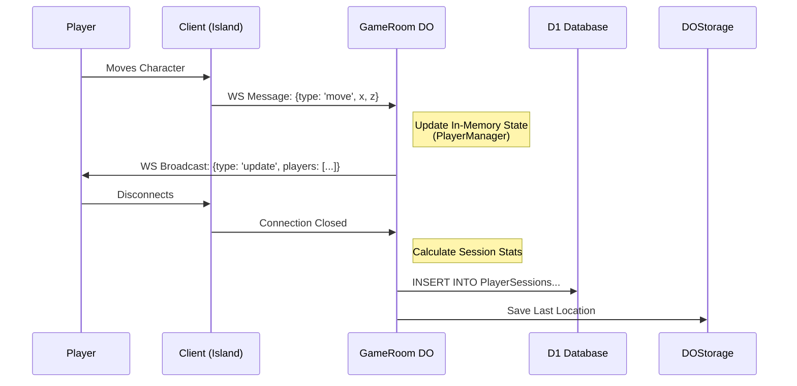

# System Architecture

> [!NOTE]
> This document serves as the **Single Source of Truth** for the Antigravity Project 1 codebase. All future development agents and engineers should consult this file to understand the system's structure, data flow, and architectural patterns.

## 1. Executive Summary

**Antigravity Project 1** is a full-stack, real-time multiplayer 3D MMO built entirely on the Cloudflare ecosystem. It leverages **Cloudflare Durable Objects** for authoritative, low-latency game servers and **HonoX** for a unified full-stack application structure. The game features a persistent world, real-time combat, farming mechanics, and user progression, all rendered in the browser using **Three.js**.

## 2. The Tech Stack

### Frontend (Client-Side)
-   **Framework**: **HonoX** (Hono/JSX) with Islands architecture.
-   **Rendering Engine**: **Three.js** (WebGL).
-   **State Management**: React-like Hooks (`useState`, `useEffect`) within Hono islands.
-   **Communication**: Native `WebSocket` API for real-time game state.
-   **Styling**: Vanilla CSS (`app/style.css`) + Inline Styles.

### Backend (Server-Side)
-   **Runtime**: **Cloudflare Workers** (Node.js compatibility mode).
-   **Game Server**: **Durable Objects** (authoritative single-threaded game loops).
-   **API Framework**: **Hono** (integrated via HonoX).
-   **Database**: **Cloudflare D1** (SQLite) for persistent relational data.
-   **AI**: Cloudflare Workers AI (referenced in `wrangler-do.toml`).

### Tooling
-   **Language**: **TypeScript** (Strict).
-   **Bundler**: **Vite**.
-   **Package Manager**: **npm**.
-   **Deployment**: Cloudflare Pages (Frontend/Routing) + Cloudflare Workers (Durable Objects).

## 3. Directory Mapping

| Path | Functional Area | Description |
| :--- | :--- | :--- |
| **`/app`** | **Core Application** | Root of the HonoX source code. |
| `/app/durable_objects` | **Game Server Logic** | Contains the authoritative game server code (`GameRoom.ts`) and managers (`PlayerManager.ts`, `FarmManager.ts`). **Critical Area**. |
| `/app/islands` | **UI & Client Logic** | Interactive client-side components. `AdminPanel.tsx` resides here. `game-canvas/` contains Three.js logic. |
| `/app/routes` | **Routing & API** | File-based routing. `index.tsx` is the home page. `api/` contains REST endpoints. |
| `/app/lib` | **Shared Utilities** | Shared helper functions. |
| **`/public`** | **Static Assets** | Publicly accessible files. |
| `/public/static` | **Game Assets** | 3D models (`.glb`), textures, and sprites. |
| **`Root`** | **Configuration** | Project config files. |
| `wrangler.toml` | Pages Config | Configuration for the main web application and routing. |
| `wrangler-do.toml` | Worker Config | Configuration specifically for the Durable Object worker. |
| `schema.sql` | Database Schema | SQL definition for the D1 database. |

## 4. Core Logic Flows

### 4.1. Data Lifecycle
1.  **Input**: User performs an action (Move, Shoot, Plant) in the Browser (Island).
2.  **Transport**: Action is serialized and sent via WebSocket to the Cloudflare Worker.
3.  **Processing**: The **Durable Object** (`GameRoom`) receives the message.
    *   `MessageHandler.ts` routes the specific action.
    *   State is updated in memory (e.g., `PlayerManager.players`).
4.  **Broadcast**: The DO broadcasts the new state (positions, events) to all connected clients via WebSocket.
5.  **Persistence**:
    *   **Hot State**: Kept in DO memory (RAM) or DO Storage (KV-like) for fast access.
    *   **Cold State**: On session end or critical events, data is written to **D1** (SQL) via `PlayerManager.handleLeave` or specific DB handlers.

### 4.2. Game Loop
-   **Location**: `GameRoom.ts` -> `startGameLoop()`.
-   **Frequency**: ~10Hz (100ms interval).
-   **Responsibilities**:
    *   Update AI (Sheep, Dragon).
    *   Process Physics (Bullet collisions).
    *   Regenerate resources (Mana, etc.).
    *   Broadcast world state to clients.

### 4.3. Authentication
-   **Provider**: Google OAuth.
-   **Flow**:
    1.  User visits `/auth/login`.
    2.  Redirects to Google.
    3.  Callback to `/auth/callback`.
    4.  Server mints a session cookie/token.
    5.  User is redirected to `/`.

## 5. State & Data Models

### 5.1. Database Schema (D1)
Defined in `schema.sql`. Key tables:
-   **`Users`**: Core account info (`id`, `google_id`, `inventory`, `coins`, `weapon`).
-   **`PlayerSessions`**: Analytics/Logs for every play session (`duration`, `kills`, `deaths`).
-   **`GameConfig`**: Global settings (e.g., `version`).
-   **`NewsPosts`**: Content for the news system.

### 5.2. Durable Object State
-   **`players` (Map)**: In-memory state of connected players (Position, Rotation, Status).
-   **`player_loc_{id}` (Storage)**: Last known location of a player (persisted in DO storage for respawn).
-   **`player_realms` (Storage)**: Active realm assignments.

## 6. Architectural Guardrails

### Do's
*   **DO**: Use Durable Objects for all *synchronous* game logic and multiplayer state.
*   **DO**: Use `GameRoom.state.storage` for high-frequency persistence (like player location).
*   **DO**: Use **HonoX Islands** (`/app/islands`) for any component that requires browser-side JavaScript (interactivity).
*   **DO**: Keep the WebSocket message payload small (e.g., utilize delta compression concepts where possible).

### Don'ts
*   **DON'T**: Query the D1 database on every game tick. This will kill performance. Use in-memory state and flush to DB asynchronously.
*   **DON'T**: Put complex game logic in the React/Three.js client. The client should be a "dumb" renderer of the state provided by the Server.
*   **DON'T**: modify `node_modules` manually.

## 7. System Visualizations

### High-Level Architecture
```mermaid
graph TD
    Client[Browser (Three.js / React)] <-->|WebSocket| Worker[Cloudflare Worker]
    Client <-->|HTTPS| Pages[Cloudflare Pages (HonoX)]
    
    subgraph "Cloudflare Ecosystem"
        Worker -->|Binds To| DO[GameRoom Durable Object]
        DO -->|Reads/Writes| D1[(D1 Database)]
        DO -->|Persists| DOStorage[DO Storage]
        Pages -->|Queries| D1
    end
```

### Game Logic Flow


## 8. Execution Instructions

### Development
1.  **Install**: `npm install`
2.  **Run Locally**: `npm run dev` (Starts Vite server + Cloudflare simulation)
3.  **Tail Logs**: `npx wrangler tail -c wrangler-do.toml`

### Deployment
Deployment is a two-step process:
1.  **Deploy Backend**: `npx wrangler deploy -c wrangler-do.toml` (Updates Durable Objects)
2.  **Deploy Frontend**: `npm run deploy` (Builds and pushes Pages assets)

**Note**: Always ensure `wrangler-do.toml` compatibility dates match `wrangler.toml`.
